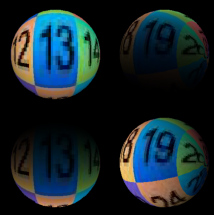
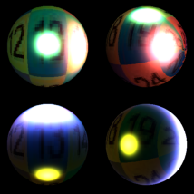

# Kaolin: A Pytorch Library for Accelerating 3D Deep Learning Research

<p align="center">
    
</p>

## Overview
NVIDIA Kaolin library provides a PyTorch API for working with a variety of 3D representations and includes a growing collection of GPU-optimized operations such as modular differentiable rendering, fast conversions between representations, data loading, 3D checkpoints and more. 

Kaolin library is part of a larger suite of tools for 3D deep learning research. For example, the [Omniverse Kaolin App](https://docs.omniverse.nvidia.com/app_kaolin/app_kaolin/overview.html) allows interactive visualization of 3D checkpoints. To find out more about the Kaolin ecosystem, visit the [NVIDIA Kaolin Dev Zone page](https://developer.nvidia.com/kaolin).

## Installation and Getting Started

Starting with v0.12.0, Kaolin supports installation with wheels:
```
# Replace TORCH_VERSION and CUDA_VERSION with your torch / cuda versions
pip install kaolin==0.12.0 -f https://nvidia-kaolin.s3.us-east-2.amazonaws.com/torch-{TORCH_VERSION}_cu{CUDA_VERSION}.html
```
For example, to install kaolin 0.13.0 over torch 1.12.1 and cuda 11.3:
```
pip install kaolin==0.13.0 -f https://nvidia-kaolin.s3.us-east-2.amazonaws.com/torch-1.12.1_cu113.html
```

We now support version 0.12.0 to 0.13.0

Visit the [Kaolin Library Documentation](https://kaolin.readthedocs.io/en/latest/) to get started!

## About the Latest Release (0.13.0)

[](./examples/tutorial/diffuse_lighting.ipynb) [](./examples/tutorial/sg_specular_lighting.ipynb)

With the version 0.13.0 we have added new [lighting features](https://kaolin.readthedocs.io/en/latest/modules/kaolin.render.lighting.html), most notably spherical gaussian [diffuse](https://kaolin.readthedocs.io/en/latest/modules/kaolin.render.lighting.html#kaolin.render.lighting.sg_diffuse_fitted) and [specular](https://kaolin.readthedocs.io/en/latest/modules/kaolin.render.lighting.html#kaolin.render.lighting.sg_warp_specular_term) reflectance, we also improved the spherical harmonics API and coefficients.

We also:
  * Reformated the data preprocessing with a new [CachedDataset](https://kaolin.readthedocs.io/en/latest/modules/kaolin.io.dataset.html#kaolin.io.dataset.CachedDataset) replacing [ProcessedDataset](https://kaolin.readthedocs.io/en/latest/modules/kaolin.io.dataset.html#kaolin.io.dataset.ProcessedDataset)
  * Fixed bug and improved speed on SPC raytracing, and added gradient on trilinear interpolation
  * Improved memory consumption on [uniform_laplacian](https://kaolin.readthedocs.io/en/latest/modules/kaolin.ops.mesh.html#kaolin.ops.mesh.uniform_laplacian)

Check out our new [tutorials](https://kaolin.readthedocs.io/en/latest/notes/tutorial_index.html):
  * Recipe for fast mesh sampling preprocessing in [examples/recipes/preprocess/fast_mesh_sampling.py](./examples/recipes/preprocess/fast_mesh_sampling.py)
  * Recipe for SPC 3d convolution in [examples/recipes/spc/spc_conv3d_example.py](./examples/recipes/spc/spc_conv3d_example.py)
  * Tutorial for diffuse lighting in [examples/tutorial/diffuse_lighting.ipynb](./examples/tutorial/diffuse_lighting.ipynb)
  * Tutorial for spherical gaussian specular lighting [examples/tutorial/sg_specular_lighting.ipynb](./examples/tutorial/sg_specular_lighting.ipynb)

See [change logs](https://github.com/NVIDIAGameWorks/kaolin/releases/tag/v0.13.0) for details.

## Contributing

Please review our [contribution guidelines](CONTRIBUTING.md).

## External Projects using Kaolin

* [NVIDIA Kaolin Wisp](https://github.com/NVIDIAGameWorks/kaolin-wisp):
   * Use [Camera API](https://kaolin.readthedocs.io/en/latest/modules/kaolin.render.camera.html), [Structured Point Clouds](https://kaolin.readthedocs.io/en/latest/modules/kaolin.ops.spc.html) and its [rendering capabilities](https://kaolin.readthedocs.io/en/latest/modules/kaolin.render.spc.html)
* [gradSim: Differentiable simulation for system identification and visuomotor control](https://github.com/gradsim/gradsim):
   * Use [DIB-R rasterizer](https://kaolin.readthedocs.io/en/latest/modules/kaolin.render.mesh.html#kaolin.render.mesh.dibr_rasterization), [obj loader](https://kaolin.readthedocs.io/en/latest/modules/kaolin.io.obj.html#kaolin.io.obj.import_mesh) and [timelapse](https://kaolin.readthedocs.io/en/latest/modules/kaolin.visualize.html#kaolin.visualize.Timelapse)
* [Learning to Predict 3D Objects with an Interpolation-based Differentiable Renderer](https://github.com/nv-tlabs/DIB-R-Single-Image-3D-Reconstruction/tree/2cfa689881145c8e0647ae8dd077e55b5a578658):
   * Use [Kaolin's DIB-R rasterizer](https://kaolin.readthedocs.io/en/latest/modules/kaolin.render.mesh.html#kaolin.render.mesh.dibr_rasterization), [camera functions](https://kaolin.readthedocs.io/en/latest/modules/kaolin.render.camera.html) and [Timelapse](https://kaolin.readthedocs.io/en/latest/modules/kaolin.visualize.html#kaolin.visualize.Timelapse) for 3D checkpoints.
* [Neural Geometric Level of Detail: Real-time Rendering with Implicit 3D Surfaces](https://github.com/nv-tlabs/nglod):
    * Use [SPC](https://kaolin.readthedocs.io/en/latest/modules/kaolin.ops.spc.html) conversions and [ray-tracing](https://kaolin.readthedocs.io/en/latest/modules/kaolin.render.spc.html#kaolin.render.spc.unbatched_raytrace), yielding 30x memory and 3x training time reduction.
* [Learning Deformable Tetrahedral Meshes for 3D Reconstruction](https://github.com/nv-tlabs/DefTet):
    * Use [Kaolin's DefTet volumetric renderer](https://kaolin.readthedocs.io/en/latest/modules/kaolin.render.mesh.html#kaolin.render.mesh.deftet_sparse_render), [tetrahedral losses](https://kaolin.readthedocs.io/en/latest/modules/kaolin.metrics.tetmesh.html), [camera_functions](https://kaolin.readthedocs.io/en/latest/modules/kaolin.render.camera.html), [mesh operators and conversions](https://kaolin.readthedocs.io/en/latest/modules/kaolin.ops.html), [ShapeNet dataset](https://kaolin.readthedocs.io/en/latest/modules/kaolin.io.shapenet.html#kaolin.io.shapenet.ShapeNetV1), [point_to_mesh_distance](https://kaolin.readthedocs.io/en/latest/modules/kaolin.metrics.trianglemesh.html#kaolin.metrics.trianglemesh.point_to_mesh_distance)and [sided_distance](https://kaolin.readthedocs.io/en/latest/modules/kaolin.metrics.pointcloud.html#kaolin.metrics.pointcloud.sided_distance).
* [Text2Mesh](https://github.com/threedle/text2mesh):
    * Use [Kaolin's rendering functions](https://kaolin.readthedocs.io/en/latest/modules/kaolin.render.mesh.html#), [camera functions](https://kaolin.readthedocs.io/en/latest/modules/kaolin.render.camera.html), and [obj](https://kaolin.readthedocs.io/en/latest/modules/kaolin.io.obj.html#kaolin.io.obj.import_mesh) and [off](https://kaolin.readthedocs.io/en/latest/modules/kaolin.io.off.html#kaolin.io.off.import_mesh) importers.

## Citation

If you are using Kaolin library for your research, please cite:

```
@misc{KaolinLibrary,
      author = {Fuji Tsang, Clement and Shugrina, Maria and Lafleche, Jean Francois and Takikawa, Towaki and Wang, Jiehan and Loop, Charles and Chen, Wenzheng and Jatavallabhula, Krishna Murthy and Smith, Edward and Rozantsev, Artem and Perel, Or and Shen, Tianchang and Gao, Jun and Fidler, Sanja and State, Gavriel and Gorski, Jason and Xiang, Tommy and Li, Jianing and Li, Michael and Lebaredian, Rev},
      title = {Kaolin: A Pytorch Library for Accelerating 3D Deep Learning Research},
      year = {2022},
      howpublished={\url{https://github.com/NVIDIAGameWorks/kaolin}}
}
```
## Contributors

Current Team:

- Technical Lead: Clement Fuji Tsang
- Manager: Maria (Masha) Shugrina
- Jean-Francois Lafleche
- Charles Loop
- Or Perel
- Towaki Takikawa
- Jiehan Wang

Other Majors Contributors:

- Wenzheng Chen
- Sanja Fidler
- Jun Gao
- Jason Gorski
- Rev Lebaredian
- Jianing Li
- Michael Li
- Krishna Murthy Jatavallabhula
- Artem Rozantsev
- Tianchang (Frank) Shen
- Edward Smith
- Gavriel State
- Tommy Xiang
